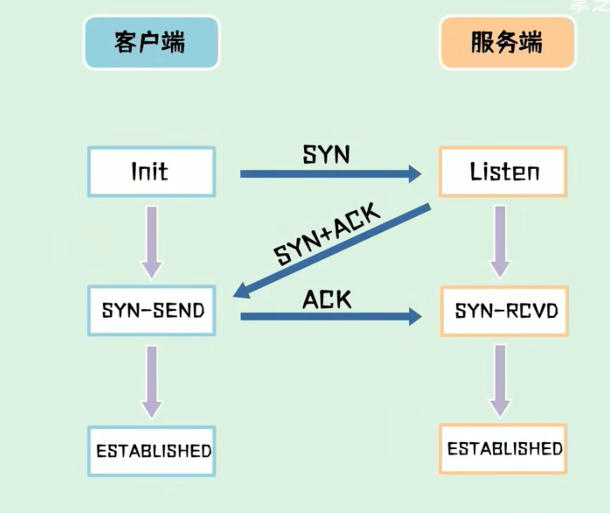

# 📘 TCP / UDP & 三次握手基础


> ✍️ 作者：桑榆  
> 🕓 更新时间：2025-12-15  
> 🧠 关键词：tcp, udp, 三次握手
 
—— 从前端发送请求到后端，发生了什么？

## 一、整体流程先看一眼（宏观视角）

当你在前端代码里写：

```javascript
fetch("https://api.example.com/user/info")
```

或者在浏览器地址栏敲下一个 URL，从点击回车到页面返回数据，大致会经历：

```text
DNS 解析
  ↓
建立 TCP 连接（三次握手）
  ↓
HTTP 请求发送
  ↓
后端处理请求
  ↓
HTTP 响应返回
  ↓
TCP 连接保持 / 关闭（四次挥手）
```

👉 TCP / UDP / 三次握手，就在这条链路的最前面。

## 二、TCP 和 UDP 是什么？（先分清角色）

1️⃣ TCP（Transmission Control Protocol）

特点：
- 面向连接
- 可靠（不丢包、按顺序）
- 有三次握手
- 有流量控制、拥塞控制

📌 HTTP / HTTPS 基本都跑在 TCP 之上

适合：
- Web 请求
- 接口调用
- 文件传输
- 数据完整性要求高的场景

2️⃣ UDP（User Datagram Protocol）

特点：
- 无连接
- 不保证可靠
- 不保证顺序
- 不需要三次握手

📌 DNS 查询、视频流、语音、实时游戏 常用 UDP

适合：
- 快
- 丢一点数据也没事

## 三、从前端发请求开始，详细流程拆解

🧩 Step 1：DNS 解析（域名 → IP）

你访问：
```text
https://api.example.com
```

浏览器并不知道服务器在哪，于是：
1.	查浏览器 DNS 缓存
2.	查操作系统 DNS 缓存
3.	查本地 hosts 文件
4.	向 DNS 服务器发起查询（通常是 UDP 53 端口）

最终得到
```text
api.example.com → 1.2.3.4
```

📌 DNS 一般使用 UDP
- 快
- 查询简单
- 失败了再试


🧩 Step 2：准备建立 TCP 连接（关键！）

现在浏览器知道了：
- 服务器 IP：1.2.3.4
- 端口：
- HTTP → 80
- HTTPS → 443

接下来要做的事情是：

“我（客户端）要和服务器建立一个可靠的通信通道”

这一步，就需要 TCP 三次握手。

## 四、TCP 三次握手（重点，面试 + 抓包必考）

📌 为什么需要三次？

为了：
- 确认双方都能收、能发
- 同步初始序列号（防止混乱和攻击）

假设采用两次握手建立连接，客户端向服务端发送一个syn，来请求建立连接，但是由于某些原因，并没有到达服务器，
客户端在中间某个网络节点产生了滞留，为了建立连接，客户端会重新发送syn包，这次的数据包正常送达，服务端回复syn+ack后，
建立了连接，但是第一包的数据阻塞的网络节点，突然恢复。第一包syn又达到了服务端，这个时候，服务端会以为发起了新的连接。会造成数据不一致。

🪜 三次握手的完整过程



### 第一次握手（Client → Server）

客户端发送一个 TCP 包：

```text
SYN = 1
seq = x
```
含义：

“服务器你好，我想跟你建立连接，这是我的初始序列号 x。”

📌 此时：
- 客户端：SYN_SENT
- 连接还没建立

### 第二次握手（Server → Client）

服务器收到后，回复一个 TCP 包：

```text
SYN = 1
ACK = 1
seq = y
ack = x + 1
```

含义：

“我收到了你的请求，我也可以建立连接，这是我的序列号 y。”

📌 此时：
- 服务器：SYN_RECEIVED

### 第三次握手（Client → Server）

客户端再发一个包：

```text
ACK = 1
seq = x + 1
ack = y + 1
```

含义：

“我也收到了你的确认，连接可以开始了。”

📌 此时：
- 客户端 & 服务器：ESTABLISHED
- TCP 连接正式建立

### 🧠 三次握手总结一句话

双方确认“你能发、我能收；我能发、你能收”，并同步通信序列号。

## 五、三次握手完成后，HTTP 才开始登场

此时已经具备：
- 客户端 ↔ 服务器 TCP 通道
- 双方知道序列号如何递增
- 可以可靠传输数据

🧩 Step 3：HTTP 请求发送（基于 TCP）

浏览器通过已建立的 TCP 连接发送 HTTP 请求：
```text
GET /user/info HTTP/1.1
Host: api.example.com
Cookie: token=xxx
User-Agent: Chrome
```

📌 HTTP 本身：
- 不关心 TCP 怎么实现
- 只关心「请求 / 响应」

📌 TCP 负责：
- 分包
- 重传
- 顺序
- 完整性

🧩 Step 4：后端处理请求（Java / Spring Boot）

服务器端流程（你熟悉的）：
1.	接收 TCP 数据
2.	还原 HTTP 请求
3.	进入 Tomcat / Netty
4.	进入 Controller
5.	业务逻辑
6.	生成 HTTP 响应

🧩 Step 5：HTTP 响应返回

服务器通过 同一条 TCP 连接 返回：

```text
HTTP/1.1 200 OK
Set-Cookie: token=abc
Content-Type: application/json

{ "code": 0, "data": {...} }
```

浏览器收到响应，解析、渲染。

## 六、TCP 连接关闭（简单了解）

如果连接不用了：
•	HTTP/1.1：可能 keep-alive
•	HTTP/2：长连接多路复用

最终关闭时会经历 四次挥手

**TCP 四次挥手**是指：

> 在 TCP 连接不再需要时，通信双方通过 **4 个报文**，有序、可靠地关闭连接。

📌 目的：
- 确保双方都 **没有数据要发送**
- 避免数据丢失
- 正确释放系统资源（端口、缓存）

## 七、为什么是“四次”，不是“三次”？

因为 TCP 是 **全双工通信**：

- 客户端 → 服务器（一个方向）
- 服务器 → 客户端（另一个方向）

👉 **关闭连接时，两个方向要分别关闭**，  
所以通常需要 **4 个报文**。

---
**客户端主动关闭连接**（常见情况）

---

### 🪜 第一次挥手（Client → Server）

客户端发送：
```text
FIN = 1
seq = u
```
含义：
> “服务器，我这边的数据已经发完了，可以关闭我 → 你的这个方向了。”

📌 状态变化：
- Client：`FIN_WAIT_1`
- Server：仍然可以发数据

---

### 🪜 第二次挥手（Server → Client）

服务器收到 FIN 后，回复：

```text
ACK = 1
ack = u + 1
```
含义：
> “我知道你不发数据了，但我这边**可能还有数据要发**。”

📌 状态变化：
- Client：`FIN_WAIT_2`
- Server：`CLOSE_WAIT`

📌 **重点理解**：
> 服务器此时只是“知道你要关”，并没有关闭它 → 客户端的数据通道。

---

### 🪜 第三次挥手（Server → Client）

当服务器的数据也发送完毕后，发送：

```text
FIN = 1
seq = v
```
含义：
> “客户端，我这边也发完了，可以一起关闭连接了。”

📌 状态变化：
- Server：`LAST_ACK`

---

### 🪜 第四次挥手（Client → Server）

客户端回复：

```text
ACK = 1
ack = v + 1
```

含义：
> “我收到了，你可以彻底关闭了。”

📌 状态变化：
- Client：`TIME_WAIT`
- Server：`CLOSED`

## 八、TIME_WAIT 状态（面试高频）

### 1️⃣ 什么是 TIME_WAIT？

客户端在发送最后一个 ACK 后，不会立刻关闭，而是进入：`TIME_WAIT`
等待一段时间（通常是 **2MSL**）

---

### 2️⃣ 为什么要有 TIME_WAIT？

#### 原因 1：防止 ACK 丢失
- 如果最后一个 ACK 丢了
- 服务器会重发 FIN
- 客户端还能重新 ACK

#### 原因 2：防止旧连接数据干扰新连接
- 保证网络中旧数据全部消失

---

### 3️⃣ 常见问题（你以后一定会遇到）

❓ 为什么客户端经常看到大量 TIME_WAIT？

✔️ 因为：
- 客户端通常是 **主动关闭连接的一方**
- HTTP 短连接 / 高并发请求

📌 安全平台、扫描器、爬虫都非常容易遇到


## 九、四次挥手状态流转总结表

| 步骤 | 客户端状态 | 服务端状态 |
|----|----|----|
| 建立连接 | ESTABLISHED | ESTABLISHED |
| 第一次 FIN | FIN_WAIT_1 | ESTABLISHED |
| ACK | FIN_WAIT_2 | CLOSE_WAIT |
| 第二次 FIN | FIN_WAIT_2 | LAST_ACK |
| 最后 ACK | TIME_WAIT | CLOSED |


## 十、工程 & 安全视角理解（非常重要）

### 🛠 工程角度
- 连接没关干净 → 资源泄漏
- TIME_WAIT 多 → 端口耗尽
- 扫描器 / 爬虫必须处理好连接复用

---

### 🔐 安全角度
- TCP 半开连接 → DoS 攻击基础
- FIN / ACK 滥用 → 端口扫描技巧
- TIME_WAIT 可用于流量特征识别

## 十一、三次握手 vs 四次挥手（对比记忆）

| 对比点 | 三次握手 | 四次挥手 |
|----|----|----|
| 目的 | 建立连接 | 关闭连接 |
| 是否同步序列号 | 是 | 否 |
| 是否必须对称 | 是 | 否 |
| 是否可能合并 | 是（SYN+ACK） | 否（一般） |

---

> **TCP 四次挥手是因为 TCP 是全双工通信，关闭连接时需要分别关闭两个方向的数据通道，客户端在最后会进入 TIME_WAIT 状态以保证连接可靠关闭。**

---